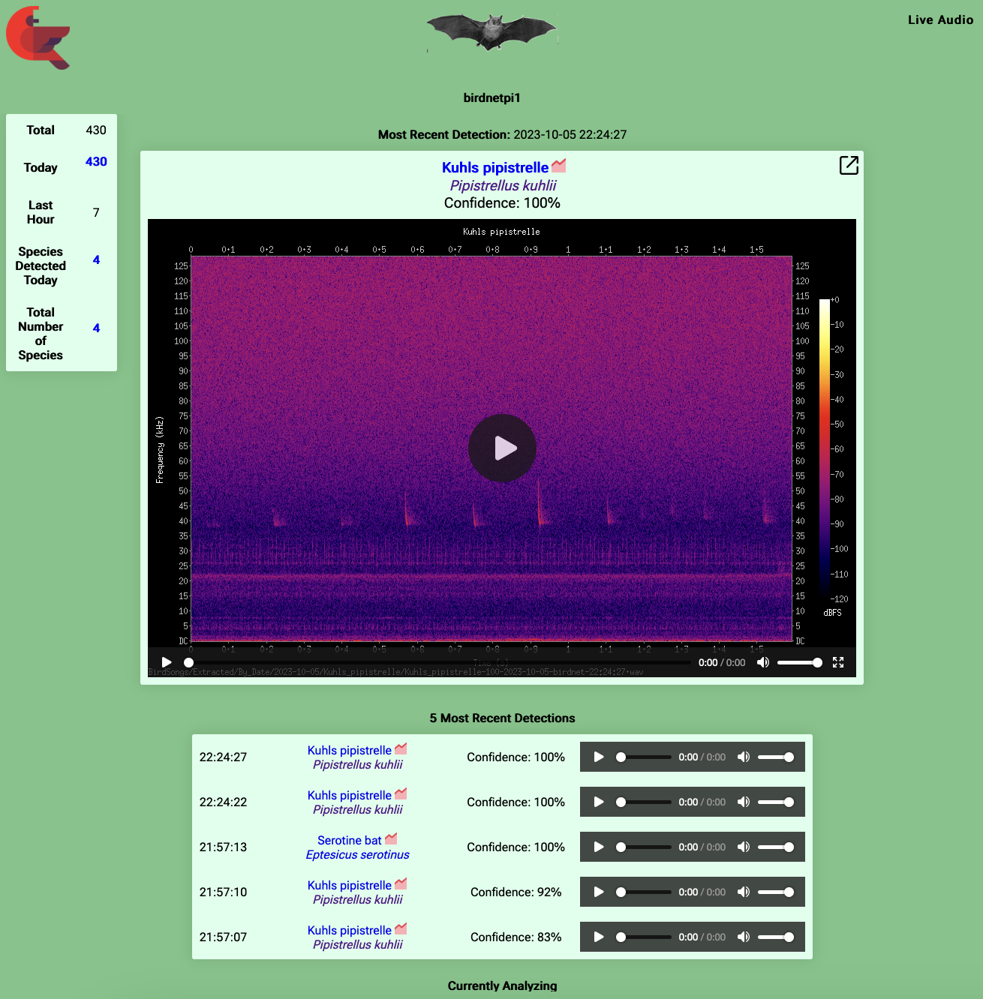

## BatNET-Pi - Automated real-time bat detector

**Note: The system is under heavy development and not (as yet) fit for production use. 
It is fully functional, however. You are welcome to try it and send feedback.**

### Purpose
Ever wondered which bat is flying in your yard and when? BatNET-Pi is readily assembled and will help you getting to know the 
night-life around you. Can also be placed remotely with a power source.

### Features

* Scans ultrasound with 256kHz sampling rate continuously 24/7 
* Automated bat ID using the companion https://github.com/rdz-oss/BatNET-Analyzer.
* Inherits many great things from BirdNET-Pi
* Right now only enabled for European bat species
* US species will be added soon

Open to the core:
* Can be assembled fully on open hardware (RaspberryPi, Audiomoth) 
* Open source operating system 
* Open source software runs it 
* Open data from GER, UK, FR, SE, USA, ... used to train the machine learning component
* Open source machine learning project for bat call identification

only limitation: you cannot use it to build a commercial system.

### Screenshot
Overview page


Including spectrograms to 128 kHz


### System components

* A Raspi 4B with 4GB or more, likely also Pi 5 will work. Use some form of passive or active cooling!
* Power supply for the Raspi and an sd card - choose a large one 64 Gb +
* A USB microphone for ultra sound: tested on audiomoth 1.2 and wildlife acoustics echo meter touch 2
* USB cable (USB C female to USB 3, 1.2m) or a USB 3 to USB 3 cable and a USB to USB C adapter
* Optional: You can use a power bank to run the system as long as the power lasts at any location. 
You might want to add some form of rain protection.

If you use the audiomoth, you will have to set the sampling frequency to 256kHz or the system will overload after a few hours.

It is easily assembled


### Install
You can follow the instructions for installing BirdNET-Pi to the point of flashing the sd card with the operating system ([see here](./README-BirdNET-Pi.md)). After that you will need to call
the install script from this repository:
```sh
curl -s https://raw.githubusercontent.com/rdz-oss/BatNET-Pi/main/newinstaller.sh | bash
```

### License

Enjoy! Feel free to use BatNET-Pi for your acoustic analyses and research. If you do, please cite as:
``` bibtex
@misc{Zinck2023,
  author = {Zinck, R.D.},
  title = {BatNET-Pi: Automated real-time bat detector},
  year = {2023},
  publisher = {GitHub},
  journal = {GitHub repository},
  howpublished = {\url{https://github.com/rdz-oss/BatNET-Pi }}
}
```

LICENSE: http://creativecommons.org/licenses/by-nc-sa/4.0/  
Also consider the references at the end of the page.

### References

### Papers

FROMMOLT, KARL-HEINZ. "The archive of animal sounds at the Humboldt-University of Berlin." Bioacoustics 6.4 (1996): 293-296.

Görföl, Tamás, et al. "ChiroVox: a public library of bat calls." PeerJ 10 (2022): e12445.

Gotthold, B., Khalighifar, A., Straw, B.R., and Reichert, B.E., 2022, 
Training dataset for NABat Machine Learning V1.0: U.S. Geological Survey 
data release, https://doi.org/10.5066/P969TX8F.

Kahl, Stefan, et al. "BirdNET: A deep learning solution for avian diversity monitoring." Ecological Informatics 61 (2021): 101236.

### Links

https://www.museumfuernaturkunde.berlin/en/science/animal-sound-archive

https://www.chirovox.org/

https://www.sciencebase.gov/catalog/item/627ed4b2d34e3bef0c9a2f30

https://github.com/kahst/BirdNET-Analyzer

https://github.com/mcguirepr89/BirdNET-Pi
