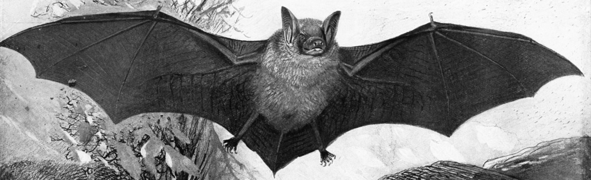
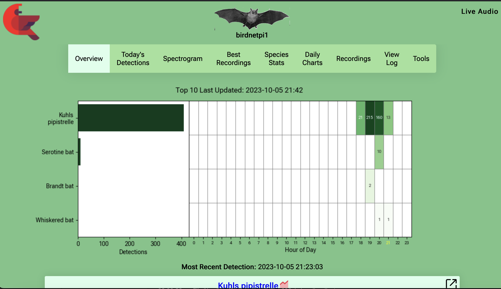
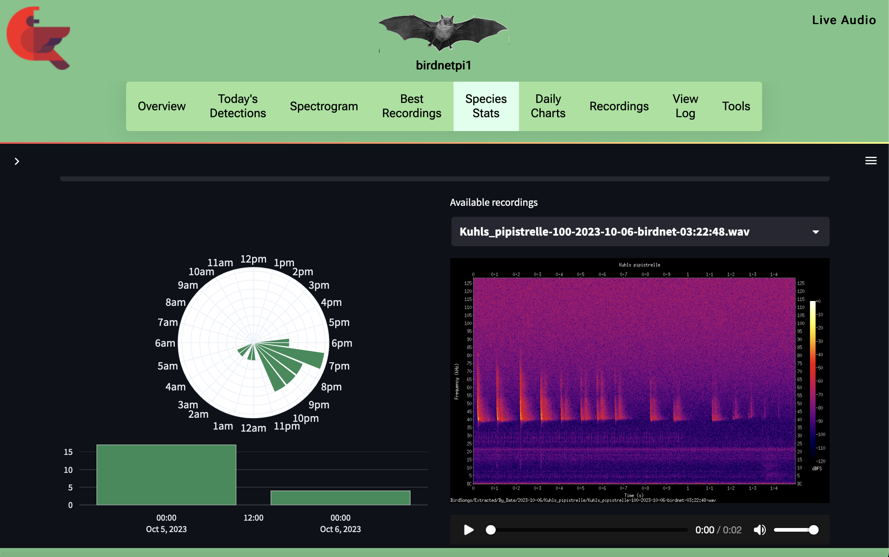
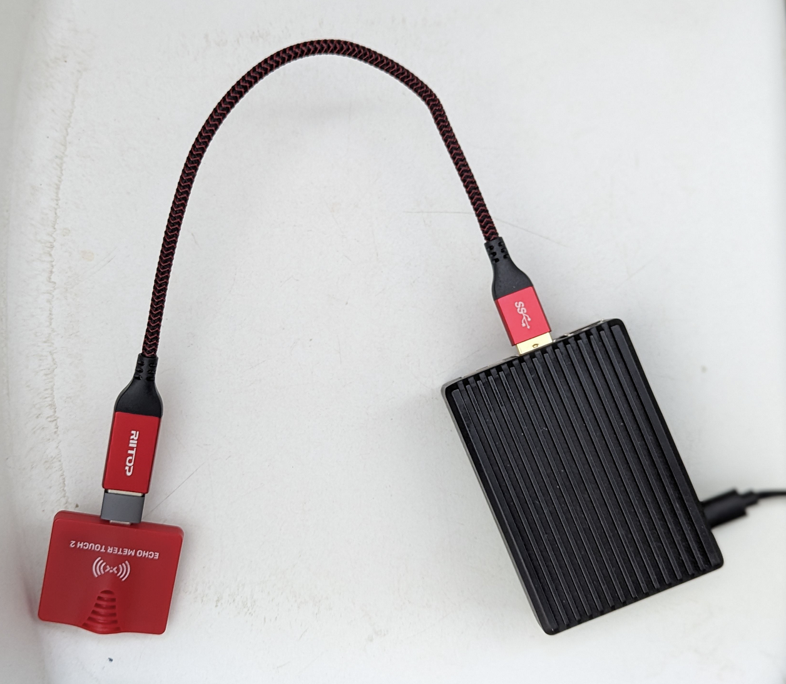
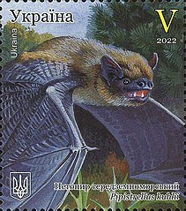
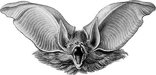
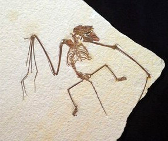
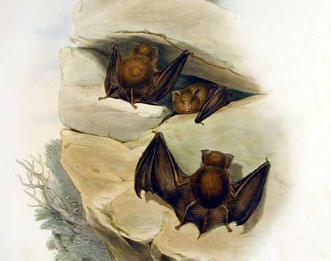

<p align="center">
  
</p>
<h3 align="center">BattyBirdNET-Pi</h3>
  
## Automated real-time bat & bird detection and identification

Extended and enhanced fork of BirdNET-Pi for bats, birds or your own fine-tuned classifier (insects, mammals, amphibians, ...). 
Use with Raspberry Pi 4 or 5 and an Audiomoth or Echo Meter Touch 2 basic or Pro. 
**'Easy' - no Linux skill required - installation option available.**

### Purpose
Ever wondered which bat is flying in your yard and when? BattyBirdNET-Pi is readily assembled and will help you getting to know the 
night and day life around you. Can also be placed remotely with a power source and set to detect birds.

* Scans ultrasound with 256kHz or 384kHz sampling rate continuously from dusk to dawn or 24/7 if you prefer 365 days a year
* Automated real-time bat ID on device using the companion https://github.com/rdz-oss/BattyBirdNET-Analyzer, recording mostly the bats and 
ignores many sources of false triggers (crickets, rain, ...). Can be set to use BirdNET vanilla to detect birds.
* Inherits many great things from BirdNET-Pi - including notifications on detection and the ability to check status live
on the internet
* Enabled for European, UK and North American species. You can make your own fine-tuned classifier for bats, birds or other animals.
* Not designed for automated biodiversity assessments but can be used if manually vetted (signals up to 190kHz).
* Adds meta-data in GUANO format to the recordings and that can be used by other analysis software.
* Replay recorded files in audible range (on 'Recordings' pages)
* Requires either audiomoth 1.2 or wildlife acoustics echo meter touch 2 microphones and RaspberryPi 4B or 5.
* Noise reduction for above microphones available

You can listen to and learn to identify bats & birds in your yard or any other place with this setup! Or make your own fine-tuned version
for enjoyment or for monitoring of an endangered species.

Keywords: bat detection, automated bat identification, deep learning, machine learning at the edge, raspberry pi, transfer learning,
citizen science, acoustic biomonitoring, audiomoth, BirdNET-Pi for bats, BatNET, Fledermaus, Fledermausdetektor, Ortungsrufe, 
Fledermausrufaufnahmen, Fledermausrufe, Rufanalyse

### Installations around the world
There are several installations in the US, Germany and the UK that I am aware of. People may take them on and of the network,
but here in general:

Germany

Munich, BY BatNet Pi 5: Currently used to track Lesser Horseshoe bats (LBV Banzerhaus) in a roost - not yet available publicly!

[Munich, BY BatNet (Pi 4)](https://munichbat.duckdns.org/)

[Frankfurt, HE BatNet](https://hoechstbat.duckdns.org/)

[St Goar, RLP BatNet](https://stgoarbat.duckdns.org:8000/)

Sweden

[Öringe, Tyresö](https://batnetpi.svardsten.se/) 

USA

[Murraysville, PA BatNets](https://pixcams.com/bat-listening-stations/)

France

[Toulouse, Occitanie]
(https://bird.thibautrey.fr)

Why not add yours, too?

### License
Enjoy! Feel free to use BattyBirdNET-Pi for your acoustic analyses and research. If you do, please cite as:
``` bibtex
@misc{Zinck2023,
  author = {Zinck, R.D.},
  title = {BattyBirdNET-Pi: Automated real-time bat detector},
  year = {2023},
  publisher = {GitHub},
  journal = {GitHub repository},
  howpublished = {\url{https://github.com/rdz-oss/BattyBirdNET-Pi }}
}
```
Be aware there is a  limitation: you cannot use it to build a commercial system.
LICENSE: http://creativecommons.org/licenses/by-nc-sa/4.0/  
Also consider the references at the end of the page.

### Screenshots
Overview page



Including stats and spectrograms to 128 kHz



### System components

* A RaspberryPi 4 or  5 with 4GB or more. Use some form of passive or active cooling!
* If you want to run the system at 384kHz continuously consider the 8GB versions.
* Power supply for the Raspi and an sd card - choose a large one 128 Gb or larger
* A USB microphone for ultra sound: tested on audiomoth usb 1.2 and wildlife acoustics echo meter touch 2 (2 and 2 pro)
* USB cable (USB C female to USB 3, 1.2m) or a USB 3 to USB 3 cable and a USB to USB C adapter
* Optional: You can use a power bank to run the system as long as the power lasts at any location. 
You might want to add some form of rain protection.

Some hints:

* The echo meter touch 2 pro works for my setup but not for some. Unknown reason at this point, might have to do with firmware version.
* https://www.openacousticdevices.info/audiomoth  (Usb or battery version with usb microphone configuration). 
You will need a USB A male to micro USB cable to connect this one.
* https://www.wildlifeacoustics.com/products/echo-meter-touch-2-android-2
* You can check the [FAQ](https://github.com/rdz-oss/BattyBirdNET/blob/main/FAQ.md).

It is easily assembled
<p align="center">
  
</p>

### Location and setup hints
1. Find a place with low noise from crickets, machinery (cars), or electrical appliances and outlets. They
tend to produce ultra sonic noise. Be aware that the RaspberryPi itself and its power source generate considerate ultra sound noise.
2. Place it in the bats flight path (elevated e.g. 3m if you can) or point it to the flight paths.
3. Place it away from reflective surfaces or other sources of echo. It does work (in Munich) between buildings, 
but there is an echo effect as well as the bats adapting to the situation (calls shift a bit).
4. If you need to deal with either bats or microphone near reflective surfaces (lakes, rivers, windows,..) point the microphone in 
45 degrees upward away from the surface to minimize effects. Effects include 'shadows' after calls (may appear as a second call or smudge)
 as well as a 'bubbly' call lines in which the reflected sound waves strengthen or cancel out the original call. Also, try to be 2m above 
a non-reflective surface to the side of the 'mirror'.
5. Shield your power converter with acoustic padding or use a long power cable to avoid the ultra sound noise
in your recordings as well as false detections. Less such issues if run from  a power bank.

#### Use as a station
You can run the station continuously if you like, e.g. at your home.
However, note that the DC/AC power converter of the RasPi (the 'plug') produces a lot of ultrasound noise that triggers the classifier. As there are many
versions out there the classifier cannot be trained on the noise of all to avoid that. Also, you will have the noise in the recordings.
So use as long a cable to get away from the power source as far as you can. Shield it if you have a way to do that e.g. by a wall.
Until another solution is found **it is recommended to run the system with a power bank.**. This way, you will only have some noise from the RasPi which
is not as bad and consistent among setups.

#### Use on the go
You can plug the RasPi into a power bank, put the entire thing in your backpack and take a walk. Use a 1.2m usb cable for this
and point the microphone to where you want.
Also, you can connect the RasPi to the WIFI hotspot on your phone. To do that, rename your phone WIFI hotspot
to the name and password expected by the RasPi ( the one you configured during installation). You got yourself a nice
bat detector for your adventures on foot. Live spectrogram included. 

### Is it good enough?
That depends on your purpose. Use your judgement, no guarantees or liability. I would not currently use it for fully automated biomonitoring. That said,
in test runs in Munich (October) the error rate was approximately (rough estimate, no science):
* Wrong 3% for every bat species flying plus 8% on noise falsely detected as bats 
* So at that location 4 bats species flying simultaneously would currently lead to approximately:  12%+8% = 20% wrong assessments on species level
per night (not counting false noise detections during daytime).
This may differ for other locations and background noises. 
* Under development - moving target. You can contribute by writing me when things are not working well.

</br></br>

<p align="center">
  
</p>

## Interpreting the classifications
In order to get the most out of the system it helps to be aware of a few things. Unfortunately you cannot just assume that a detection is always due to a bat.
Essentially, a classification is a suggestion that it is one of these similar groups. Often right - but also expect mismatches in
the below categories.

You can use local knowledge to find the most likely species together with the classifier suggestion.
Also, you can consult handbooks on bat call identification.

### Noise can trigger the classifier

This can be reduced by not entirely avoided. Look at the spectrogram visualization and decide if this is a noise trigger. This is very likely the case during daytime, and it does happen at night. Expect that this happens.
There are many sources of such noise:
  - The RaspberryPi itself (operating noise). This is filtered out to a large degree by the classifiers.
  - The power plug of the RaspberryPi. This pollutes the recordings and triggers false detections. Take care
  to use noise cancelling foam around it or to get as big a distance between the power plug and the microphone.
  Or use a power bank.
  - Cars while operating, parking, reversing etc. Also, sometimes they have ultrasound based deterrents for martens.
  - Rain, wind, rustling leaves or grass go into ultrasound.

### Some bats have near identical calls

There are several bat species which make very similar sound which can be hard for experts to manually tell apart. This is also hard for the classifier. Expect that the classifier identifies both species the call might have originated from. The more likely one will be identified more often, but you need to check with an expert or consult expert materials yourself.
Bats in Europe which have similar calls include, but are not limited to:

  - Myotis daubentonii and Myotis mystacinus/brandtii
  - Myotis mystacinus and Myotis brandtii are so similar they were added to one category (mystacinus) in the EU classifiers
  - Pipistrellus nathusii and Pipistrellus kuhlii
  - Pipistrellus pipistrellus and Pipistrellus pygmaeus
  - Nyctalus leisleri, Eptisecus serotinus, Vespertilio murinus
  - Plecotus auritus and Plecotus austriacus  are both under Plecotus auritus in the classifier
  - There are often two or more species flying at the same time. 

so expect that there is a certain degree of overlap between the species or two or more present in a sample. 

### Other animals 
  - Bush crickets can confuse the classifier. The classifier is trained to ignore them on samples from GER and SE, but not all types.
  - Harvest/wood mice can be in 30kHz and even 50kHz range, also brown and other rats and rodents.
  - Owls can be present e.g. with harmonics, also many other birds such as black birds.
  - Frogs/Toads tend to stay below 10kHz.

### Artifacts and harmonics
- Aliasing describes artifacts produced by a sample rate that is too low for some frequencies produced by a bat, i.e. 
spurious harmonics or mirrored effects. This might happen e.g. for a Myotis call that goes higher than 128 kHz. Lesser horseshoe bat calls should
still be captured without a mirror effect.
- Clipping is an issue related to cutoff of frequencies when the gain (loudness) of a microphone is set too high and
the system cuts off upper and lower frequencies (above the max volume the system can handle). Set e.g. the gain in the Audiomoth to intermediate/medium level.
- A sound at a certain frequency e.g. 40kHz can appear as a harmonic 'shadow' at 80kHz, 120 kHz etc.

</br></br>

<p align="center">
  
</p>

### Typical call frequencies of bats

* Calls are very variable and affected by the bats surroundings
* Short, medium and long calls can have different characteristics e.g. in myotis species. Long and very long
calls of Myotis species should still be visible in the upper end at 256kHz sampling rate. Short and medium sized calls can go to 150kHz and higher
and require a higher sampling rate.
* In woodland there are many obstacles to avoid and bat sound become more similar
* It is not always possible to ID a bat just from echolocation calls
* There are echo location calls as well as social calls. Social calls can be on very different frequencies (lower, even audible).
* Feeding buzzes occur when a bat closes in on prey. The number of calls/time increases and the frequency (kHz) goes down in a 'buzz'.


### Echolocation frequency (max energy) of European bats
A quick overview for a first orientation. Bats shift up or downwards depending also on each others presence and 
the environment. Highest energy is the lightest color in the spectrogram. More detailed information in German, but many illustrations and tables that are understandable:

- [Nyctalus, Eptesicus, Vespertilio, Pipistrellus, Long eared, Horseshoes and Barbastelle ](https://www.lfu.bayern.de/publikationen/get_pdf.htm?art_nr=lfu_nat_00378)
 For these species the minimum (or end) frequeny of a call and duration  can be very informative.
- [Myotis](https://www.lfu.bayern.de/publikationen/get_pdf.htm?art_nr=lfu_nat_00427)
For myotis species the start (often highest) as well as end (often lowest) frequency as well as the duration are informative.
There can also be a characteristic 'S' shape in the call. The highest frequencies can require 160kHz or more (extreme 185kHz) 
resolution, ie 320kHz or 384 kHz settings.

Echolocation frequency (max energy) | Common name           | Species                   | 
|-----------------|-----------------------|---------------------------|
20-25 kHz | Noctule               | Nyctalus noctula          | 
25 kHz | Leislers              | Nyctalus leisleri         | 
27 kHz | Serotine              | Eptisecus serotinus       | 
28 kHz  | Vespertilio murinus   | Part-coloured bat         | 
32 kHz  | Eptisecus nilssoni    | Northern bat              | 
32 kHz | Barbastelle           | Barbastella barbastellus  | 
35kHz | Mouse eared bat       | Myotis myotis             | 
39 kHz | Nathusius pipistrelle | Pipistrellus nathusii     | 
36-40 kHz | Kuhls pipistrelle     | Pioistrellus kuhlii       | 
43-46 kHz | Alcathoe              | Myotis alcathoe           | 
45 kHz | Common pipistrelle    | Pipistrellus pipistrellus | 
45 kHz | Whiskered             | Myotis mystacinus         | 
45 kHz | Brandts               | Myotis brandtii           | 
45 kHz | Daubentons            | Myotis daubentonii        | 
45-50 kHz | Brown long-eared      | Plecotus auritus          | 
45-50 kHz | Grey long-eared       | Plecotus austriacus       |
50 kHz | Natterers             | Myotis natteri            | 
50 kHz | Bechsteins            | Myotis bechsteinii        | 
55 kHz | Soprano pipistrelle   | Pipistrellus pygmaeus     | 
80 kHz | Greater Horseshoe     | Rhinolophus ferrumequinum | 
108 kHz | Lesser Horseshoe      | Rhinolophus hipposideros  | 

### Eastern US Species
More information: [Eastern US](https://www.sonobat.com/download/EasternUS_Acoustic_Table_Mar2011.pdf)

Echolocation frequency (max energy) | Common name                 | Species                   | 
|-----------------|-----------------------------|---------------------------|
21 kHz | Hoary bat                   | Lasiurus cinereus         | 
28 kHz | Free–tailed bat             | Tadarida  brasiliensis    | 
29 kHz | Northern yellow bat         | Lasiurus intermedius      | 
29 kHz | Silver–haired bat           | Lasionycteris noctivagans | 
32 kHz | Big brown bat               | Eptesicus fuscus          | 
31 kHz | Townsend’s big–eared bat    | Corynorhinus townsendii   | 
33 kHz | Rafinesque’s big–eared bat  | Cornorhinus rafinesquii   | 
40 kHz | Evening bat                 | Nycticeius humeralis      | 
43 kHz | Seminole bat                | Lasiurus seminolus        | 
44 kHz | Little brown bat            | Myotis lucifugus          | 
44 kHz | Tri-colored bat             | Perimyotis subflavus      | 
44 kHz | EasternRed Bat              | Lasiurus borealis         | 
44 kHz | Indiana bat                 | Myotis sodalis            | 
46 kHz | South-eastern myotis        | Myotis austroriparius     | 
48 kHz | Gray bat                    | Myotis grisescens         | 
49 kHz | Eastern small–footed myotis | Myotis leibii             |
51 kHz | Northern long-eared myotis  | Myotis septentrionalis    | 

### Western US Species
More information: [Western US](https://www.sonobat.com/download/WesternUS_Acoustic_Table_Mar2011.pdf)

Echolocation frequency (max energy) | Common name                     | Species                   | 
|-----------------|---------------------------------|---------------------------|
12.5 kHz | Spotted bat                     | Euderma maculatum         |
13 kHz | Mastiff bat                     | Eumops perotis            |
22 kHz | Hoary bat                       | Lasiurus cinereus         |
25 kHz | Big freetailed / pocketed bats  | Nyctinomops spp.          |
28 kHz | free–tailed bat                 | Tadarida brasiliensis     |
29 kHz | Silver–haired bat               | Lasionycteris noctivagans |
30 kHz | Fringed myotis                  | Myotis thysanodes         |
31 kHz | Townsend’s big–eared bat        | Corynorhinus townsendii   |
32 kHz | Pallid bat                      | Antrozous pallidus        |
32 kHz | Big brown bat                   | Eptesicus fuscus          |
37 kHz | Western yellow bat              | Lasiurus xanthinus        | 
39 kHz | Long–eared myotis               | Myotis evotis             | 
42 kHz | Western red bat                 | Lasiurus blossevillii     | 
44 kHz | Little brown bat                | Myotis lucifugus          | 
48 kHz | Hairy–winged myotis             | Myotis volans             | 
48 kHz | Canyon bat (western pip.)       | Parastrellus hesperus     |
49 kHz | Small–footed myotis             | Myotis ciliolabrum        | 
53 kHz | California myotis               | Myotis californicus       | 
55 kHz | Yuma myotis                     | Myotis yumanensis         | 

</br></br>

<p align="center">
  
</p>

### Install

An 'easy' install method is described here ( no Linux know-how required): [Installation.md](https://github.com/rdz-oss/BattyBirdNET/blob/main/Installation.md).
You will need to download an image with pre-installed BattyBirdNET-Pi: [Latest image](https://cloud.h2887844.stratoserver.net/s/BBjYnSZZPdaacYw/download/BattyBirdNET-bookworm-arm64-lite-latest.img.xz)


If you like you can alternatively use the 'regular' method:

* Install Raspbian OS 64 bit lite on the sd card (currently Bookworm based). Set a system user, name and configure your WIFI. If you have not done this before, 
you can follow the instructions for installing BirdNET-Pi to the point of flashing the sd card with the operating system ([see here](./README-BirdNET-Pi.md)). 
* After that you will log in to the RasPi with your username and password via ssh (it should be in your wireless LAN after booting)
* You call the install script from this repository (i.e.. this is where you deviate from the instructions found for BirdNET-Pi)
```sh
curl -s https://raw.githubusercontent.com/rdz-oss/BattyBirdNET-Pi/main/newinstaller.sh | bash
```
The operating system is now updated, two repositories are pulled from github, files are copied for the automation of services, the webserver setup etc.
Might take a few minutes. When done, it will reboot. **If you see a bat flying in the middle of the WbUI - you have installed BattyBirdNET-Pi**.

You can connect to the WebUI via your browser if you are in the same WIFI network. It should show up under http://name-you-gave-it.local .
This sometimes does not work depending on your router configuration. You can look up the ip address given to the BattyBirdNET-Pi
in your router and call that directly from the browser, e.g. http://192.168.178.XX . Alternatively, tools like Ning (https://f-droid.org/packages/de.csicar.ning/) on your smartphone will
list all the devices in your network. The BattyBirdNET-Pi should show up.

#### Update
Via UI: "Tools" > "System Controls" > "Update".
On commandline
```sh
/usr/local/bin/update_birdnet.sh
```

#### Uninstall
```sh
/usr/local/bin/uninstall.sh && cd ~ && rm -drf BirdNET-Pi
```
Should you want to change the branch you are on (default is 'main') you can use
```sh
git fetch
git pull origin 'branchname'
```
There are two systems installed BattyBirdNET-Pi and BattyBirdNET-Analyzer.
You can set a preferred branch for each individually.

#### Options for the bat classifier

You can set several options under 'Tools - Settings - Advanced Settings' (default user is 'birdnet', no password) including
* Sampling rate. Choose one that is suitable for your requirements and available from your microphone. Default is 256kHz.
You can select 256kHz, 288kHz, 320kHz and 384kHz. They work with both Pi4 and Pi 5. 
The Pi 4 uses about 70% of its memory (in case of 4GB) and processor power at 384kHz settings. The Pi 5 has more resources.
* If you use an audiomoth, you can set it to 384kHz. BattyBirdNet-Pi will automatically down sample to the chosen setting.
* The EM 2 can do 256kHz. The Pro version can be used with all settings.
* You can set a time for dusk and dawn. The system will then be online yet stop recording and classifying during the day.
* You can switch to bird recording during the day with vanilla BirdNET v2.4 and record bats at night.
* You can choose a noise filter and noise reduction factor. The noise filter is specific for a microphone.
* It is not recommended to set the reduction factor higher than 0.5 as you loose some information.
* The sensitivity and confidence settings for the classifier are also on the advanced settings page yet in a different box.
* Experienced users can consider changing some parameters directly in the file '/etc/birdnet/birdnet.conf'. You need to set
* BAT_CLASSIFIER and LAST_BAT_CLASSIFIER together to the same value
* You can fine tune/cross train your own classifier with your data using https://github.com/rdz-oss/BattyBirdNET-Analyzer and contribute it via 
pull request (to BattyBirdNET-Analyzer and -Pi). This way, you could e.g. have a fine tuned model for detecting a rare species (bird, bat, insect, mammal, other) 
for conservation/biomonitoring reasons or to add a classifier for a new/your region.


#### To use the North American/UK version:

* Install as above
* Go to the Tools setting
* Log in as user 'birdnet', leave password empty
* Settings -> Advanced Settings -> Bat Classifier (use USA or UK)
* If you have set your lat/lon before on the basic settings you can activate the 
automatic sunrise/sunset determination service
* You can activate the switch to bird detection during the day if you like

#### Making the system available online

* You should activate https by adding an URL with https:// prefix to 'Tools - Settings - Advanced Settings - Custom URL'
* You can set up a Domain name, if you own one (you need to point your domain's A/AAAA DNS records at your Pi),
or use an URL from a DynDNS service. Follow their instructions, e.g. https://www.duckdns.org/ 
* Set complex passwords for the Webinterface (Tools-Settings) as well as the underlying Linux system/user on the command line
```sh
sudo passwd
```
* Setup a firewall e.g. using ufw, allowing only https and if you want ssh
```sh
sudo apt-get install ufw
sudo ufw allow ssh
sudo ufw allow https
sudo ufw enable
```
* Update the underlying Raspberry Pi OS frequently to benefit from security fixes 
```sh
sudo apt-get update && sudo apt-get upgrade -y
```
* If you are in a home setting, you will need to enable a port forwarding in your router (to the BattyBirdNET-Pi and respective ports ( usually ssh on 22, https on 443, http on 80))
* Update your router firmware frequently (automatically is best) and setup your router firewall

#### Saving your data
If you are not comfortable on the command line you can use the Webinterface (Tools- File Manager) and navigate to the folders
```sh
### Save the detections database and extracted calls
/home/bat/BirdNET-Pi/scripts/birds.db
/home/bat/BirdSongs/Extracted/By_Date/ 
```
If you are comfortable with using the command line you can setup rsync to either push data from the Pi to a NAS or cloud storage ( e.g. S3) or to remotely log into the Pi and pull the data to a computer or NAS.
For example, pulling the data from the Pi onto your computer (you can change the ssh port number as needed)
```sh
### Save the detections database
sshpass -p your_passwd rsync -a -P -e "ssh -p 22" bat_user@byour_pis_ip_or_url:/home/bat/BirdNET-Pi/scripts/birds.db /your/local/storage/path
### Save the extracted calls data
sshpass -p your_passwd rsync -a -P -e "ssh -p 22" at_user@byour_pis_ip_or_url:/home/bat/BirdSongs/Extracted/By_Date/ /your/local/storage/path/recordings

```
The simplest way to automate this procedure is via cron. Make your backup script executable and add a line to the crontab 
```sh
#! /bin/bash
### Save the detections database
sshpass -p your_passwd rsync -a -P -e "ssh -p 22" bat_user@byour_pis_ip_or_url:/home/bat/BirdNET-Pi/scripts/birds.db /your/local/storage/path
### Save the extracted calls data
sshpass -p your_passwd rsync -a -P -e "ssh -p 22" at_user@byour_pis_ip_or_url:/home/bat/BirdSongs/Extracted/By_Date/ /your/local/storage/path/recordings
```
If you are not comfortable with cleartext passwords, you can write it in a file (set it to chmod 0400 pass_file) and use 'sshpass -f pass_file ...'' . For automation, 'chmod +x your_backup_script.sh' and use 'crontab -e' to add your job. For example, if it should back up at 2:30am every day, that line (add with crontab -e) would be
```sh
30 2 * * * /path/to/your_backup_script.sh
```

You can also copy your data to an S3 object store bucket in the public cloud, i.e. your Pi pushes the data at regular intervals to cloud storage. To do this you first need to make an account with a cloud provider and configure an S3 bucket together with an S3 user that has the rights to read and write to this bucket. There are many such cloud providers, European ones include the French OVH cloud and German IONOS clouds.
Then, install the tool 'rclone' on your Pi
```sh
sudo apt-get install rclone
```
now configure it with your cloud provider, S3 bucket and user details
```sh
rclone config
```
You can use the following script to backup both your database as well as call data. 
```sh
#! /bin/bash
echo "Start" >> /home/bat/cronjob/log.txt
date >>  /home/bat/cronjob/log.txt
rclone copy /home/bat/BirdNET-Pi/scripts/birds.db BackupStorageS3:your_bucket_name/db/
echo "Saved db ..." >> /home/bat/cronjob/log.txt
rclone copy /home/bat/BirdSongs/Extracted/By_Date/ BackupStorageS3:your_bucket_name/data/ --log-file=/home/bat/cronjob/rclone-log.txt
echo "Saved call data ..." >> /home/bat/cronjob/log.txt
```
Put it in the directory '/home/bat/cronjob'
```sh
mkdir /home/bat/cronjob
cd /home/bat/cronjob
# put the backup script here and name it backup.sh
chmod +x backup.sh
```
You can call this script manually 
```sh
/home/bat/cronjob/backup.sh
```
or add it to be run automatically by cron (see above rsync example).


#### Freeing space on the device
After saving the data (see above), you can delete folders form the past e.g. via the 'Tools - File Manager'. 
```sh
### Extreacted calls by date are here
/home/bat/BirdSongs/Extracted/By_Date/ 
```
This will make some 'Best recordings' unavailable. The system can be set to automatically delete old data when the disk runs full (Tools-Settings), yet I have found that to be buggy.
* Do not delete the database 'birds.db'!

#### Debugging
The system consists of several systemd services that use/call each other, python scripts as well as an squlite database and a web UI (php/java script). Some useful commands to check if services are up and their status. 
```sh
# Get the logs from some systemd services 
journalctl -eu birdnet_analysis -u birdnet_server -u batnet_server | sudo tee -a /var/log/syslog
cat /var/log/syslog  | grep error
# Are the APIs up?
ss -nltp
# A script with comprehensive information
/usr/local/bin/print_diagnostic_info.sh
```
Audio 
```sh
cat /proc/asound/cards
```
Check if settings are correct in /etc/asound.conf with above info 
and change defaults.pcm.card 
defaults.ctl.card to the correct values if necessary:
```sh
sudo nano /etc/asound.conf
```
add the defaults (replace '1' by the number you found for your card):
```sh
defaults.pcm.card 1
defaults.ctl.card 1
```

</br></br>

<p align="center">
  
</p>

### Acknowledgements
* This project would not have been possible without the developers of BirdNET and BirdNET-Pi.
* Thanks to the Animal Sound Archive Berlin, ChiroVox, NABAT and XenoXanto databases and individual data donors:
Kelvin R. (UK), Guillaume M. (FR), Svardsten L. (SE), Zinck R. (GER).
* Thank you for your great work at testing Kelvin!
* Thank you @spambake and Bill from Pixcams Inc for your support in getting the US version up to shape!
* Thank you community for tips and testing! Your help is much appreciated!

### References

### Papers

FROMMOLT, KARL-HEINZ. "The archive of animal sounds at the Humboldt-University of Berlin." Bioacoustics 6.4 (1996): 293-296.

Görföl, Tamás, et al. "ChiroVox: a public library of bat calls." PeerJ 10 (2022): e12445.

Gotthold, B., Khalighifar, A., Straw, B.R., and Reichert, B.E., 2022, 
Training dataset for NABat Machine Learning V1.0: U.S. Geological Survey 
data release, https://doi.org/10.5066/P969TX8F.

Kahl, Stefan, et al. "BirdNET: A deep learning solution for avian diversity monitoring." Ecological Informatics 61 (2021): 101236.

### Links

https://www.museumfuernaturkunde.berlin/en/science/animal-sound-archive

https://www.chirovox.org/

https://www.sciencebase.gov/catalog/item/627ed4b2d34e3bef0c9a2f30

https://github.com/kahst/BirdNET-Analyzer

https://github.com/mcguirepr89/BirdNET-Pi

### Other projects you might be interested in

https://github.com/cloudedbats/cloudedbats_wurb_2024

https://github.com/Taslim-M/Bat2Web

http://www.bat-pi.eu/

https://www.bto.org/our-science/products-and-technologies/bto-acoustic-pipeline

https://www.wsl.ch/de/services-produkte/batscope/

